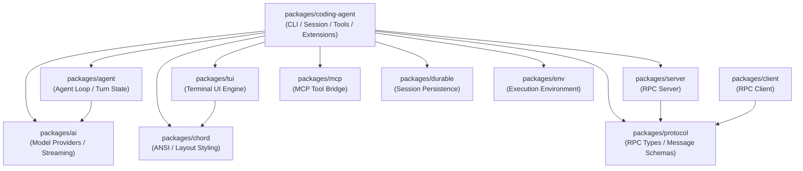

# Pi 代码图谱与架构全景 (CODEGRAPH)

本文档为 Pi (`@earendil-works/pi`) 项目的系统性架构剖析与核心符号图谱。定位一律采用「文件路径 + 类名/函数名/类型名」符号锚点，不依赖物理代码行号。

---

## 1. Monorepo 架构全景

Pi 是一个基于 npm workspaces 构建的极简、高可扩展的 Agent 运行底座。各个包之间遵循单向依赖拓扑：



---

## 2. 核心运行时生命周期与执行流

当用户在交互模式、Print 模式或 RPC 模式下发出指令时，整体生命周期流转如下：

```mermaid
sequenceDiagram
    participant User as 用户 / TUI
    participant Session as AgentSession (packages/coding-agent)
    participant CoreAgent as Agent (packages/agent)
    participant Loop as agentLoop (packages/agent)
    participant AIProvider as AI Provider (packages/ai)
    participant Tool as Built-in Tool (packages/coding-agent)

    User->>Session: prompt(text)
    Session->>CoreAgent: prompt(AgentMessage)
    CoreAgent->>Loop: runAgentLoop(messages, config)
    Loop->>AIProvider: streamSimple(messages, tools)
    AIProvider-->>Loop: Stream chunks (text / toolCall)
    Loop-->>Session: AgentEvent ("message_update" / "tool_call")
    Session-->>User: 渲染实时输出 (TUI/Stdout)
    Loop->>Tool: execute(args) (如 read / edit / bash)
    Tool-->>Loop: ToolResult (output / isError)
    Loop->>AIProvider: 回传 ToolResult 继续推理
    AIProvider-->>Loop: 最终 Assistant 回复
    Loop-->>CoreAgent: Turn 完成
    CoreAgent-->>Session: 触发持久化与事件通知
```

---

## 3. 核心包清单与符号锚点

### 3.1 `packages/agent`：通用 Agent 驱动循环与状态机

核心职责：脱离具体业务与终端的纯净 Agent 执行核心，管理上下文消息、工具调用循环、生命周期事件分发。

- **`packages/agent/src/agent.ts`**
  - `class Agent`：Agent 顶层封装实体。持有当前状态、模型配置、工具清单及消息队列。
  - `function createMutableAgentState`：初始化 Agent 内部可变状态机。
  - `interface AgentOptions`：构建 Agent 的配置选项。
- **`packages/agent/src/agent-loop.ts`**
  - `function agentLoop`：启动 Agent 事件流循环，返回 `EventStream<AgentEvent, AgentMessage[]>`。
  - `function runAgentLoop`：核心递归/迭代推进逻辑，调用 LLM -> 解析 Tool Calls -> 批处理执行 Tool -> 构造 ToolResult -> 驱动下一轮 Turn。
  - `type AgentEventSink`：Agent 事件接收器。
- **`packages/agent/src/types.ts`**
  - `interface AgentContext`：包含系统提示词、可用工具声明与上下文转换钩子。
  - `type AgentMessage`：Agent 内部流通的标准化消息结构。
  - `interface AgentTool<TArgs, TResult>`：Agent 工具接口。

### 3.2 `packages/ai`：多模型抽象层与流式传输

核心职责：统一不同云厂商（Anthropic, OpenAI, Google Gemini, Ollama, Bedrock 等）的 API 差异、Token 计算与工具声明映射。

- **`packages/ai/src/models.ts`**
  - `interface Model<TConfig>`：模型元数据定义（上下文窗口大小、最大 token、计费价格、能力标签）。
  - `const KNOWN_MODELS`：内置主流模型元数据表。
- **`packages/ai/src/providers/`**
  - `anthropic.ts` / `openai.ts` / `google.ts` / `bedrock.ts`：各 Provider 的流式 API 适配器与报文归一化。
- **`packages/ai/src/api/`**
  - `function streamSimple`：通用流式推理入口，抹平不同 Provider 的底层差异。
  - `function toToolDeclaration`：将标准工具接口转换为各模型支持的 JSON Schema。

### 3.3 `packages/coding-agent`：编码助手实现与集成体系

核心职责：Pi 的主要落地应用。包含会话维护、内置文件与命令工具、配置加载、插件/扩展机制及交互模式入口。

- **`packages/coding-agent/src/main.ts` & `src/cli.ts`**
  - `function main`：CLI 解析、环境检查、加载配置与分发至对应模式。
- **`packages/coding-agent/src/core/agent-session.ts`**
  - `class AgentSession`：重量级会话状态管理类。处理 prompt 排队、上下文压缩（Compaction）、扩展（Extensions）触发、工具拦截与日志持久化。
  - `function createAgentSession`：工厂函数，装配内置服务、工具与会话管理器。
- **`packages/coding-agent/src/core/tools/`**
  - `read.ts -> function createReadTool`：分块、安全读取文件。
  - `write.ts -> function createWriteTool`：原子性新建/写入文件。
  - `edit.ts & edit-diff.ts -> function createEditTool`：代码精确替换与统一 Diff 审查生成。
  - `bash.ts -> function createBashTool`：执行系统 Shell 命令、会话保持与超时控制。
  - `grep.ts -> function createGrepTool` / `find.ts -> function createFindTool`：代码检索。
- **`packages/coding-agent/src/core/resource-loader.ts`**
  - `class ResourceLoader`：负责从 `.pi/`、用户全局目录中自动发现 skills、extensions、prompts 和 themes。
- **`packages/coding-agent/src/modes/`**
  - `interactive/index.ts`：交互式 TUI 运行模式入口。
  - `print-mode.ts`：批处理/脚本一次性输出模式。
  - `rpc/index.ts`：通过 stdio 或网络对外暴露的 RPC 服务模式。

### 3.4 `packages/tui`：终端交互引擎与渲染框架

核心职责：高性能终端 UI 库，实现类似 Web DOM 的节点树布局、ANSI 调色板、快捷键分发及光标管理。

- **`packages/tui/src/tui.ts`**
  - `class TerminalUI`：主渲染循环、重绘节流与终端全屏/Alt-Screen 控制器。
- **`packages/tui/src/editor-component.ts`**
  - `class EditorComponent`：富文本多行输入框，支持历史记录漫游、撤销重做与语法高亮。
- **`packages/tui/src/keys.ts` & `src/keybindings.ts`**
  - `function parseKeySequence`：按键 ANSI 逃逸序列解析器。
  - `const DEFAULT_APP_KEYBINDINGS`：全局快捷键配置表。

---

## 4. 关键流转数据结构示例

### 4.1 核心消息体结构 (`AgentMessage`)

在 `packages/agent` 内部，单轮对话的消息定义如下：

```json
{
  "role": "assistant",
  "content": [
    {
      "type": "text",
      "text": "正在执行检查，请稍候。"
    },
    {
      "type": "tool_use",
      "id": "call_123456",
      "name": "bash",
      "input": {
        "command": "npm run check"
      }
    }
  ]
}
```

### 4.2 工具执行结果体 (`ToolResult`)

```json
{
  "callId": "call_123456",
  "toolName": "bash",
  "isError": false,
  "content": [
    {
      "type": "text",
      "text": "Biome checked 152 files. No errors found."
    }
  ]
}
```

### 4.3 模型元数据定义 (`Model`)

```typescript
{
  id: "claude-3-7-sonnet-20250219",
  name: "Claude 3.7 Sonnet",
  api: "anthropic",
  provider: "anthropic",
  baseUrl: "https://api.anthropic.com/v1",
  reasoning: true,
  contextWindow: 200000,
  maxTokens: 8192,
  cost: {
    input: 3.0,
    output: 15.0,
    cacheRead: 0.3,
    cacheWrite: 3.75
  }
}
```

---

## 5. 调试与学习切入点建议

1. **入口追踪**：从 `packages/coding-agent/src/main.ts` -> `src/core/agent-session.ts` 进入，理解 CLI 是如何被解析并启动会话的。
2. **Loop 状态机**：阅读 `packages/agent/src/agent-loop.ts` 中的 `runAgentLoop`，这是理解整个 Agent「思考 - 调工具 - 观察结果 - 再次思考」本质的最小内核。
3. **工具封装**：阅读 `packages/coding-agent/src/core/tools/edit.ts`，体会生产级 Agent 是如何安全做代码替换与 Diff 呈现的。
